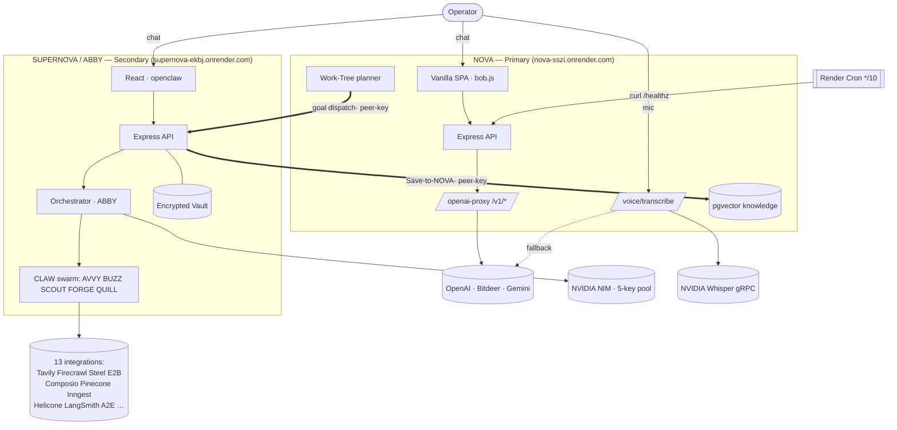
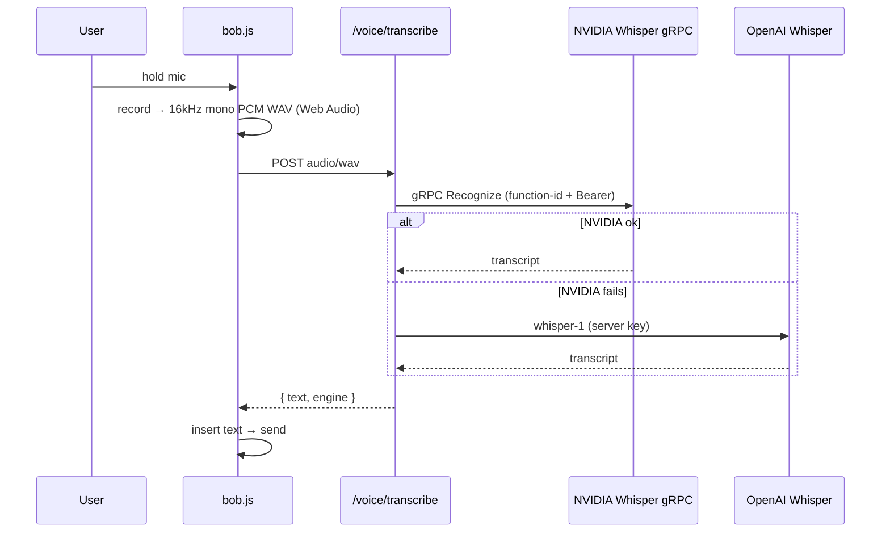
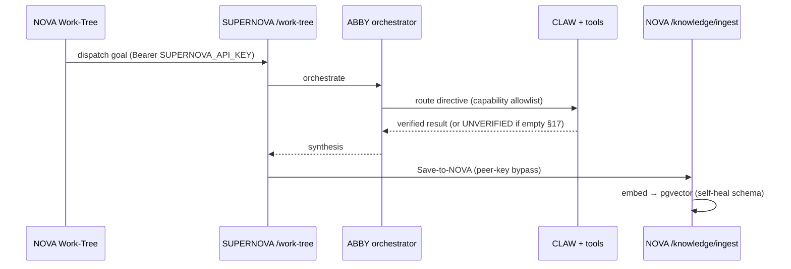

# Twin‑System Architecture — NOVA × SUPERNOVA/ABBY

> One operator, two cooperating services: **NOVA** (primary personal assistant) and
> **SUPERNOVA / ABBY** (secondary autonomous agent swarm). They share auth, memory,
> and a relay so either can hand work to the other.

| | Primary | Secondary |
|---|---|---|
| **Name** | NOVA | SUPERNOVA / ABBY ("Abby AI") |
| **Role** | Personal AI assistant + Work‑Tree planner | Multi‑agent swarm orchestrator |
| **Repo** | `paisabrazilfl-cpu/Nova-` | `paisabrazilfl-cpu/newsupernova` |
| **Live** | https://nova-sszi.onrender.com | https://supernova-ekbj.onrender.com |
| **Render** | `srv-d8do…3iq0` · plan `free` · Docker | `srv-d8om…d5ig` · plan `standard` · prebuilt dist |
| **Frontend** | vanilla SPA (`index.html`+`bob.js`) | React + Vite (`openclaw`) |
| **Keep‑alive**| Render Cron `nova-keepalive` `*/10` → `/healthz` | always‑on (standard plan) |

---

## 1 · System topology



---

## 2 · Request lifecycles

**Voice → text (NOVA):**


**Cross‑app: NOVA Work‑Tree → SUPERNOVA swarm → back into NOVA memory:**


---

## 3 · Repo maps (ASCII)

### NOVA — `paisabrazilfl-cpu/Nova-`
```
Nova-/
├── Dockerfile ················ builds api-server, serves nova-static
├── .agents/memory/ ··········· internal-rules · twin-system-doctrine
├── artifacts/
│   ├── nova/                    ◀ FRONTEND (vanilla SPA, no build step)
│   │   ├── index.html ········ shell · Gemini tokens · 3D thinking cube · drawer
│   │   └── public/assets/bob.js  chat engine · stream · voice → /voice/transcribe
│   │                              · §17 empty-guard · scramble-fix (#streaming-row)
│   └── api-server/src/
│       ├── app.ts ············ express SPA + ?v=<commit> cache-bust
│       ├── routes/  health · openai-proxy · voice · knowledge · work-tree · scratchpad
│       └── lib/     work-tree-auth (PIN + peer-key) · knowledge (pgvector self-heal)
├── scripts/  deep-worker · work-tree-worker · nova-cli · daemons
└── lib/  api-client-react · api-spec · api-zod · db (drizzle)
```

### SUPERNOVA / ABBY — `paisabrazilfl-cpu/newsupernova`
```
NEWSUPERNOVA/
├── render.yaml · CLAUDE.md · .agents/memory/
├── artifacts/
│   ├── openclaw/src/            ◀ FRONTEND (React + Vite, content-hashed)
│   │   ├── index.css ········· Gemini tokens · 3D cube · spark
│   │   ├── pages/   chat · dashboard · agents · tasks · cron · settings
│   │   └── components/dashboard/  SwarmCanvas · SwarmDispatch · SwarmIdleHint
│   │                              · SwarmStatusStrip · ChatStream · SteelBrowser …
│   └── api-server/src/
│       ├── orchestrator.ts ··· ABBY engine: route→dispatch→tools→synthesize · §17
│       ├── tools.ts ·········· TOOL_REGISTRY + AGENT_TOOLS allowlist
│       ├── routes/  ai · swarm · agents · tasks · integrations · nova · steel
│       │            · social · vault · external(+Vapi) · auth(OPEN_ACCESS)
│       └── lib/     integrations (NIM pool · Helicone · LangSmith · Tavily · Exa
│                    · Inngest · Composio) · embeddings · pinecone · vault*
│                    · safety* · scheduler · relay · twinSync · worldEngine
└── lib/  api-client-react · api-spec · api-zod · db
```

---

## 4 · Swarm roster (deterministic capability allowlist · `tools.ts AGENT_TOOLS`)

| Agent | id | Capability |
|---|---|---|
| **ABBY** | 1 | Full authority · orchestrates & synthesizes |
| **AVVY** | 2 | `image_generate`, `video_generate` |
| **BUZZ** | 3 | social · Composio · marketing · scheduling |
| **SCOUT**| 4 | `web_search/scrape/screenshot` · memory |
| **FORGE**| 5 | code · sandbox · deploy · research‑when‑stuck |
| **QUILL**| 6 | docs · PDF · artifacts |

---

## 5 · Integration matrix (wire + ruleset)

| Provider | Cat | Env | Endpoint | Guard | Status |
|---|---|---|---|---|---|
| NVIDIA NIM | llm | `NVIDIA_API_KEY`+`_2.._5` | integrate.api.nvidia.com | fail‑closed · 5‑key rotate · breaker | ✅ |
| Helicone | obs | `HELICONE_API_KEY` | gateway→NIM | safe when unset | ✅ |
| LangSmith | obs | `LANGSMITH_API_KEY`/`LANGCHAIN_API_KEY` | api.smith.langchain.com | fire‑and‑forget | ✅ |
| Embeddings | mem | `EMBEDDINGS_API_KEY` (+`EMBEDDINGS_BASE_URL`) | OpenAI‑compat (1536) | key must match base | ✅¹ |
| Pinecone | mem | `PINECONE_API_KEY`+`PINECONE_INDEX_HOST` | *.pinecone.io | index must be 1536/cosine | ✅¹ |
| Tavily | search | `TAVILY_API_KEY` | api.tavily.com | fail‑closed · chain #1 | ✅ |
| Exa | search | `EXA_API_KEY` | api.exa.ai | optional | ⚪ off |
| Firecrawl | search | `FIRECRAWL_API_KEY` | api.firecrawl.dev | fail‑closed · chain | ✅ |
| Steel | browser | `STEEL_API_KEY` | api.steel.dev | fail‑closed | ✅ |
| Inngest | events | `INNGEST_EVENT_KEY` | inn.gs | fire‑and‑forget · 5s | ✅ |
| E2B | sandbox | `E2B_API_KEY` | e2b SDK | fail‑closed · timeout | ✅ |
| Composio | tools | `COMPOSIO_API_KEY` | backend.composio.dev | 400 guard · exec gate | ✅ |
| Image gen | tools | `IMAGE_API_KEY`/`OPENAI_API_KEY`/`A2E` | DeepInfra→gpt‑image‑1→A2E | auto‑fallback chain | ✅² |
| Video gen | tools | `A2E_API_KEY` | A2E | async · fail‑closed | ✅ |

¹ verify index dim=1536 / embeddings key is OpenAI‑compatible · ² premium FLUX menu needs DeepInfra `IMAGE_API_KEY`

**Official social APIs** (IG/FB/X/Reddit/YouTube/TikTok) auth via `lib/connectors` (Replit connector proxy) — **not available on Render**; use **Composio** / `instagram_post` (vault token) instead.

---

## 6 · Security model

- **Secrets**: env vars + encrypted Vault (`vault.ts`, loaded into env at boot). Referenced in tools as `{{secret:NAME}}`, injected at call time, never logged/shown to agents/model. Never committed.
- **Auth**: operator session; `OPEN_ACCESS=1` bypass on SUPERNOVA. NOVA gated endpoints (`/knowledge`,`/integrations`,`/work-tree`) behind PIN, with shared‑key **peer bypass** for trusted twin calls.
- **CORS**: `ALLOWED_ORIGINS` explicit on SUPERNOVA.
- **Cache**: HTML `no-cache`; hashed assets immutable; fixed‑name assets `?v=<git-commit>` per deploy.
- **§17 hardening**: empty/placeholder LLM output → `UNVERIFIED`/blocked, never a fake success.

---

## 7 · Deploy

```
git push main ─▶ GitHub ─▶ Render (manual or auto) ─▶ build ─▶ live ─▶ /healthz verify
```
Branch discipline: `ai/YYYY-MM-DD-short-summary` from latest `main`, no regressions.

---

_This document reflects the verified state of the build. Update it with each architectural change._
